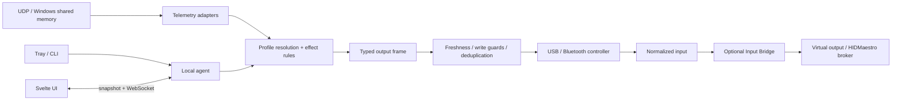

# Architecture

The Windows tray launches the local Rust agent and opens the Svelte 5 + Vite UI.
The agent owns profiles, telemetry, persistence, controller access and API safety.
Defaults: API/UI `127.0.0.1:43473`; Forza UDP `127.0.0.1:5300`.

Detection may set the lightbar before telemetry arrives. Game trigger/rumble
effects require fresh telemetry; manual tests expire. Identical encoded reports
are suppressed until keepalive. See [AGENTS](../AGENTS.md) for safety and timing
contracts; [ADRs](adr/) explain the boundaries.

## Crate owners

| Crate | Owns |
| --- | --- |
| `dscc-core` | Profiles, effect rules, value sources, typed output frames. |
| `dscc-telemetry` | Normalized signals, snapshots, adapter contracts/status. |
| `dscc-adapters` | Built-in catalog and clean-room parsers. |
| `dscc-device` | HID discovery, input, diagnostics, encoding and guarded writes. |
| `dscc-virtual-output` | Output trait, HIDMaestro stdio client and mock backend. |
| `dscc-agent` | API, persistence, resolution, detection, Steam Input and runtime loops. |
| `dscc-tray` | Windows launcher; health, menu, painting and tests under `src/windows_tray/`. |
| `dscc-cli` | Diagnostics and local commands, including `serve`. |

## Change entry points

Search symbols with `rg`. Agent paths below are relative to
`crates/dscc-agent/src/`; keep validation and effects with their owner.

| Task | Source / constraint |
| --- | --- |
| Routes / DTOs | `routes.rs::app`, `api/`, `agent_types.rs`: validate intent before mutation. |
| Snapshot | `lib.rs::AgentState::snapshot`: no blocking I/O under state locks; Input Bridge health is cached. |
| Network guards | `http_security.rs::reject_cross_origin_mutations`, `bind_addr.rs`, `env_policy.rs`. |
| Profile resolution | `profiles.rs::profile_resolution`: stable controller id + game scope; aliases only label controllers. |
| Live effects | `effects/materialization.rs::RuntimeLiveEffectMaterializer`, `effects/runtime_profiles.rs`: prepared cache, stateful smoothing/hysteresis. |
| Output / discovery | `runtime/{hardware_output,output_watchdog,device_scan}.rs`, `runtime_constants.rs`: cadence, freshness, keepalive, neutralization. |
| Manual output | `api/effects.rs`, `lib.rs::begin_manual_output_override`: controller-scoped ownership checked inside the serialized typed writer; expiry releases only its owned session. |
| Telemetry freshness | `adapter_runtime.rs`, `assetto_shared_memory.rs`, `effects/materialization.rs`: enabled adapters, changed producer samples, source/session baseline reset. |
| Input Bridge | `input_bridge.rs`, `dscc-virtual-output`: cached health uses an independent bounded status probe; session creation validates the live provider. |
| Game detection | `game_detection_cache.rs::DiscoveryCache`, `game_detection/`: cached filesystem metadata, fast process scan. |
| Persistence | `persistence.rs`: distinguish missing/unreadable/invalid state, exclusive recovery copies, ordered atomic saves; `routes.rs` applies `require_persistence_available` to persisted mutations. |
| Steam writes | `steam_input/{writer,paddle_preset}.rs`: canonical-target transaction lock, complete slot selectors, exclusive backups, preimage recheck and atomic replacement. |
| Support privacy | `support_bundle.rs`: opaque path fields and free-text sanitation; no private raw reports or identifiers. |
| Defaults / paths | `built_in_presets.rs`, `runtime_paths.rs`. |
| FH6 glyph install | `forza_glyphs.rs`: trusted roots, immutable original backups; restore originals before changing archives. |

## Device and browser boundaries

| Source | Owns |
| --- | --- |
| `crates/dscc-device/src/output.rs` | Output sessions, input reads, guarded writes, Edge dispatch. |
| `crates/dscc-device/src/output/input.rs` | Normalized sticks, triggers, buttons. |
| `crates/dscc-device/src/output/encoding.rs` | Typed USB/Bluetooth encoding, clamps, CRC. |
| `crates/dscc-device/src/hidapi_transport.rs` | HID access and write suppression. |
| `web/src/main.ts`, `App.svelte` | Mount, shell, hash routing, shared state. |
| `web/src/lib/api/`, `types.ts` | Typed boundary; `snapshotMapping.ts::mapSnapshotDto` normalizes DTOs; `api.ts` re-exports. |
| `web/src/lib/appRuntime.ts::createAppRuntime` | Snapshot socket/polling; stop removes listeners/timers. |
| `web/src/app/` | Navigation, selections, profile/effect and shell workflows. |
| `web/src/lib/features/` | `haptics/`: tuning/curves; `buttonMapping/`: Steam mirror; `controllers/ControllerCard.svelte`: status; `games/AddGameDialog.svelte`: registration. |
| `web/src/lib/mock/` | Dev fixtures; excluded from production builds. |

`web/src/app/navigation.ts` defines routes and view constraints. Global Profile
offers controller tuning; Game Profiles expose telemetry routing.

## Extension and onboard contracts

Game Modules use `moduleId`; Telemetry Adapters use `adapterId`. Live adapters:
`forza-data-out` (UDP), `assetto-shared-memory` (Windows shared memory). Catalog
metadata starts no listeners. Community modules remain data-only; see the
[contribution guide](game-module-contribution-guide.md).

Edge feature-report access varies by host/transport. Fn + Circle/Cross/Square
accept static edits; Fn + Triangle stays protected. Sync requires acknowledgement
and matching typed readback; unavailable paths stage locally. Live effects
require DSCC running. See the [hardware matrix](hardware-matrix.md) for evidence.
