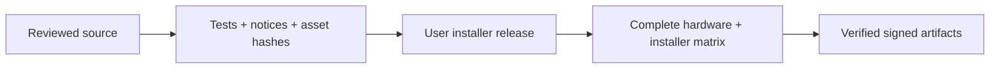

# Release readiness

Version: **0.5.1**. Release evidence below includes September 30 validation.
The [October 7 audit remediation](codebase-audit-2026-10-07.md) preserves
the existing UI layout and artwork; the separate UX rework is excluded.
Full production validation remains open; no new release is included.

| Gate | Evidence | Next action |
| --- | --- | --- |
| Source | Atomic persistence; bounded broker/discovery; guarded shutdown; loopback security; concise task/agent guides | Run [checks](contributing.md#validation) on the merged version |
| Redistribution | Existing mapping SVGs retained; dependency notices refreshed for the patched source-map-js lock | Run exact hashes, notices and the [distribution gate](release-trust.md) on the integrated tree |
| Hardware | User confirmed Edge Bluetooth L2/R2, rumble, blue lightbar and neutralization on the 0.5.0 audit working tree; graceful exit took 10ms | Complete the exact-version [matrix](hardware-matrix.md): USB, reconnect, telemetry, session end and onboard settings |
| Standard MSI | Published 0.5.0 → 0.5.1 upgrade, reinstall launch, shortcuts, uninstall, config retention and process cleanup pass on the existing account **with startup disabled** | Verify startup and clean-account install using [Installer Smoke](windows-installer-smoke.md) |
| Startup | MSI reports a registry write that independent native reads cannot see; speculative helpers were removed | Resolve the discrepancy in a clean Windows account; leave startup unchecked meanwhile |
| Bridge | Ordinary PR CI compiles the broker; local .NET 10 SDK Release build passes with zero warnings/errors; dependency/runtime notices retained | Validate actual provider payloads, installation and lifecycle |
| Signing | 0.5.1 explicitly unsigned; no certificate configured | Configure [credentials](release-trust.md) and verify an actual signed artifact |
| Linux | Source/packaging implemented; native hardware evidence pending | Keep [beta](linux-beta.md) claims until native HID checks pass |

## October 7 audit-only integration checks

The complete environment, web, Rust, broker, docs, release and performance
checks pass on the audit-only tree: 401 Rust tests, 68 workflow cases and
55 compiled-App browser cases. Independent extraction and final code reviews
are clean. Exact notices/distribution checks, advisory scans and installer
preflight pass. The [audit](codebase-audit-2026-10-07.md#current-verification-october-7)
records this bundle's measurements and hardware-disabled production smoke.
Compilation, mocks and hardware-disabled smoke tests do not establish physical
controller, provider or MSI-installation behavior.

## Historical September 30 checks

- Rust: format, all-feature Clippy and 361 workspace tests pass; two manual tests ignored.
- Web: typecheck, source/snapshot/haptics checks, build, 12 visual cases and drag budget pass.
- Mapping p95: lookup 0.047ms / chips 0.039ms / parse 0.004ms. Drag: 16.7ms p95,
  13.7 mutations/move. Synthetic results do not measure native HID latency.
- Bundle: 784.2 KiB raw / 438.0 KiB gzip. npm and Cargo advisory scans report zero
  known vulnerabilities. Repeat scans before release.

Treat historical audit results separately from current CI. Publish validation
limits in release notes; compilation and mocks cannot close physical gates.
