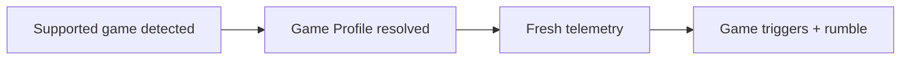

# Troubleshooting

## Windows Warns About The Installer

Use the [official Releases page](https://github.com/shiftedx/dualsense-command/releases/latest),
verify its SHA256 and choose `standard` unless testing non-Steam DSCC Input
Bridge. Unsigned prereleases may trigger publisher warnings. Follow
[Release Trust](release-trust.md) before continuing; delete downloads from
untrusted sources.

## The App Does Not Open

Start **DualSense Command Center** from the Start menu, check the tray, then
open `http://127.0.0.1:43473/`. If unavailable, quit from the tray and restart.
Reopen the first-run guide with **Guide** in the header.

## Controller Is Not Detected

Try USB, close competing controller apps, reconnect and restart DSCC. Check the
[hardware matrix](hardware-matrix.md) for transport-specific evidence.
Edge onboard sync depends on host feature-report access; acknowledgement and
matching readback are required. Unavailable writes remain staged locally.

## Forza Telemetry Is Not Working

Enable **Data Out** / **UDP Race Telemetry** in the game: IP `127.0.0.1`,
port `5300`. Enter a driving session; close other listeners on that port and
check Windows Firewall if packets remain absent.

Detection may set the lightbar before packets arrive. Triggers and rumble stay
neutral without fresh telemetry and neutralize after the 2s stale cutoff.

## API Errors Everywhere

Open the tray's page or `http://127.0.0.1:43473/`. Replace stale dev-server,
`file://` or remote tabs. LAN access requires **Web UI Location → LAN Access**,
save and restart; enable it only on a trusted network.

If Support reports `api: ok`, record the failed action and exact error: the
agent is reachable, so investigate that action rather than restarting blindly.

## Battery Drops Faster Than Expected

Check **Controller details → Power** for write cadence. Dim lights, prefer
native body rumble passthrough when appropriate, or use USB for long sessions.
Suppressed reports indicate duplicate writes avoided while retaining the frame.

## Optional Forza Button Glyphs

No glyph pack is shipped. Set `DSCC_FORZA_GLYPH_ARCHIVE` to a local
`ControllerIcons.zip` you have permission to use (maximum 16 MiB), then restart
the agent. Keep the archive for restore; originals remain backed up beside the
target files. A missing archive causes an error without changing game files.

## Linux Page Does Not Open

Run the complete extracted archive, including `web/dist`; follow the
[Linux Beta Guide](linux-beta.md#run-the-release-archive). A source build needs
its built UI or an absolute `DSCC_WEB_DIST` path.

## Linux Controller Opens Only With Sudo

Fix [udev permissions](linux-beta.md#hid-and-udev-permissions), reconnect and
retest as your user. Do not run DSCC with `sudo`. If trigger previews lag, test
USB and HID permissions first; preview processing runs inside the agent.

## Steam Input Button Mapping Looks Empty

Open/create and save a real Steam Input layout for the selected game, then
refresh DSCC. Placeholder defaults cannot be written back. Edge paddle presets
require existing **Back Left** and **Back Right** bindings in that layout;
save it in Steam's configurator before retrying.

## Create A Support Bundle

Open **Support → Copy JSON / Export JSON**. If the UI fails but the agent runs,
use `dscc-cli support-bundle`. Review the bundle and screenshots before sharing;
do not add raw HID paths, serials, Bluetooth addresses, account identifiers or
reports manually.

## Reporting A Problem

Use [Discussions](https://github.com/shiftedx/dualsense-command/discussions)
for setup/tuning questions; file reproducible failures in
[Issues](https://github.com/shiftedx/dualsense-command/issues) with:

- Version, OS, controller model and USB/Bluetooth transport.
- Exact action, expected result, actual result and error text.
- Game/telemetry status and failed [matrix step](hardware-matrix.md#validation-checklist), if applicable.
- Sanitized support bundle and reconnect/restart result.
