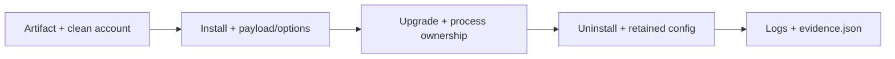

# Windows Installer Smoke

Validate the supplied MSI on a clean Windows account/VM before publishing.
This procedure mutates installs only with `-Execute`; it disables hardware
output and bounds MSI actions with timeouts.

## Script

Run non-mutating preflight from the repository root:

```powershell
powershell -NoProfile -ExecutionPolicy Bypass -File packaging\windows-installer-smoke.ps1 -MsiPath .\target\installer\DualSenseCommandCenter-<version>-standard.msi
```

After checking the artifact/hash, run on a disposable clean account with a
**distinct previous MSI**:

```powershell
powershell -NoProfile -ExecutionPolicy Bypass -File packaging\windows-installer-smoke.ps1 -BaselineMsiPath <previous-msi> -MsiPath .\target\installer\DualSenseCommandCenter-<version>-standard.msi -Execute
```

Omitting the baseline tests same-version reinstall and produces partial
evidence. Before a major installer release, repeat with an option override:

```powershell
powershell -NoProfile -ExecutionPolicy Bypass -File packaging\windows-installer-smoke.ps1 -MsiPath .\target\installer\DualSenseCommandCenter-<version>-standard.msi -Execute -StartWithWindows 0 -CreateDesktopShortcut 1 -LaunchAfterInstall 0
```

## What It Checks



| Check | Required result |
| --- | --- |
| Preflight | Non-empty MSI/SHA256; no DSCC install markers or tray/agent processes unless explicitly overridden. |
| Payload | Per-user install under `%LOCALAPPDATA%\Programs\DualSense Command Center`; notices and expected flavor files. |
| Options | Start-menu shortcut; desktop shortcut and HKCU run key match selections. |
| Launch | When enabled, at most one tray and agent, both from the current install folder. |
| Upgrade | Payload/options/process checks repeat; isolated config probe survives. |
| Uninstall | Installer-owned payload, shortcuts, run key and processes removed; config probe retained, then test-owned probe cleaned up. |

## Evidence and Release Checklist

Logs and sanitized `evidence.json` go to a temporary `dscc-msi-smoke-*` folder
or `-LogDirectory`. Retain failure logs with release evidence. **Passed** requires
all clean-account checks plus a distinct baseline; dirty-account, skipped-check
and same-version runs are **partial**. Preflight/retention self-tests:

```powershell
powershell -NoProfile -ExecutionPolicy Bypass -File packaging\windows-installer-smoke.test.ps1
```

Current local evidence: non-startup install/reinstall/uninstall passed on an
existing account, so lifecycle evidence remains partial. Native startup-enabled
MSI behavior is not verified in this host; a script test cannot close that gate.
Track outstanding gates in [Production Readiness](production-readiness-plan.md).

## Setup Properties

| Property | Default | Meaning |
| --- | --- | --- |
| `DSCC_START_WITH_WINDOWS` | `1` | HKCU login entry for `dscc-tray.exe --startup`. |
| `DSCC_CREATE_DESKTOP_SHORTCUT` | `0` | Current-user desktop shortcut. |
| `DSCC_LAUNCH_AFTER_INSTALL` | `1` | Launch tray/agent after first install. |

## Installer Flavors

| Flavor | Expected payload |
| --- | --- |
| `standard` | No `hidmaestro` folder; normal user path. |
| `bridge` | Self-contained broker in `hidmaestro`; larger payload. |
| `bridge-framework-dependent` | Framework-dependent broker; matching x64 .NET runtime required. |

Use [Release Trust](release-trust.md) for download, checksum and signing policy;
use the [hardware matrix](hardware-matrix.md) for physical controller checks.
